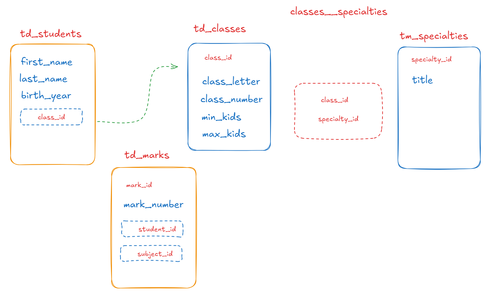

Да се разработи база данни - на училище. Като за начало имаме следните обекти:
- ученици
- класове
- специалности
- предмети
- оценки
- учители които преподават

Използвайте следната примерна структура за да разработите връзките между отделните таблици.

#### Връзки(1:N)
- Ученик : Клас --> 1:1
- Клас : Ученик --> N:1

####  Връзки (N:N)
- Клас : Специалност --> 1:N
- Специалност:Клас --> 1:N

####  Връзки (N:N) -- свързваща таблица
- Учител:Предмет --> 1:N
- Предмет:Учител --> 1:N

#### Връзки(1:N:N)
- Ученик:Предмет:Оценка

Добавете примерни записи във всяка една от таблиците.